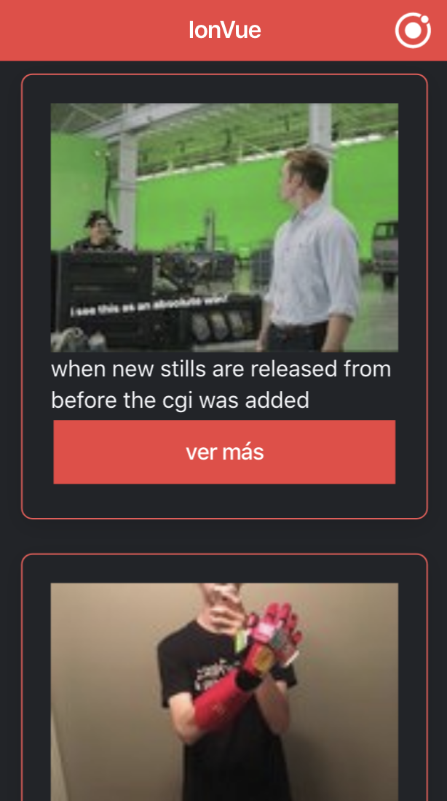

# ionic4-vue-reddit



## Inicia instalacion de los paquetes
```
npm install
```

### Compilaciones para Desarrollo
```
npm run serve
```

### Compila y minimiza para Producción
```
npm run build
```

### Ejecutar para pruebas
```
npm run test
```

### Ficheros y arreglos de archivos.
```
npm run lint
```

